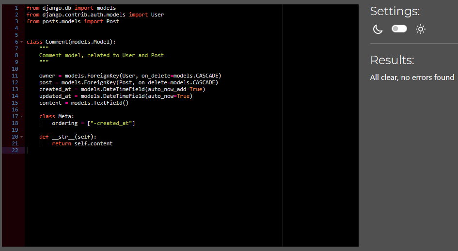

<h1 align="center"> Feast Your Eyes - DRF API </h1>

[View the live project here](https://fye-drf-api-6b84783d9a37.herokuapp.com/)

Feast Your Eyes DRF API – a robust data management solution leveraging the capabilities of Django Rest Framework. This API ensures seamless communication between your backend and React front end, streamlining resource management with efficiency. With Feast Your Eyes API, you can effortlessly handle the creation, updating, and deletion of resources, all while adhering to RESTful principles.

Notably, the API's capability for smooth JSON data transmission stands out, providing a standardized format for exchanging information between backend and frontend components. This feature enhances the overall responsiveness of your application, contributing to a more streamlined and user-friendly experience.

[For the Front End please visit](https://github.com/yamesjamess/p5-feast-your-eyes)

## Table of Contents

- [User Experience](#user-experience)
- [Features](#features)
- [Design](#design)
- [Technologies Used](#technologies-used)
- [Testing](#testing)
- [Deployment](#deployment)
- [Credits](#credits)

## User Experience

The relevant User Stories for the API are from #2 to #8. For the remaining User Stories, please refer to the Front End repository.

### User Stories :

- **USER STORY (#2)** : Project Setup

  - As a developer I can use all the info from the requirement to set up a repo so that I can start develop to API model and the front end.

- **USER STORY (#3)** : Profiles Model

  - As a admin I can login to the admin panel so that I can manage user profiles.

- **USER STORY (#4)** : Posts Model

  - As a superuser I can manage Posts so that I can create, update, delete and view the details of the posts I wish to display.

- **USER STORY (#5)** : Likes Model

  - As a superuser I can manage the Likes so that I can create, update, delete and view the likes of the posts I wish to display.

- **USER STORY (#6)** : Comments Model

  - As a superuser I can manage Comments so that I can create, update, delete and view the details of the comments I wish to display

- **USER STORY (#7)** : Recommended Model

  - As a superuser I can manage the Recommendations so that I can create, update, delete and view the recommendations of the posts I wish to display.

- **USER STORY (#8)** : Followers Model

  - As a superuser I can manage the Followers so that I can create, update, delete and view the followers I wish to display.

## Features

### Existing Back End Features

**BE Feature (#1)** : Django Rest Framwork

- Since the front end website is being built using React, there is no need for the backend server to return HTML documents.
- Django Rest Framework is a powerful tool to create, read, update, delete data in JSON form.

**BE Feature (#2)** : Profile Model

- The profile model includes these fileds

  - owner: a 1to1 field linking with User model that is created upon successful profile creation. Cascade on deletion.
  - created_at: DateTimeField with auto_now_add=True
  - updated_at: DateTimeField with auto_now=True
  - name: CharField with max length of 255 (optional)
  - content: TextField (optional)
  - image: ImageField (optional, placeholder is add on creation)

- The profile list view accepts List action.
- The profile detail view accepts Retrieve and Update. Update is available if is_owner.

**BE Feature (#3)** : Post Model

- The post model includes these fileds

  - owner: ForeignKey field linking with User model. Cascade on deletion.
  - created_at: DateTimeField with auto_now_add=True
  - updated_at: DateTimeField with auto_now=True
  - restaurant: CharField with max length of 255
  - title: CharField with max length of 255
  - name: CharField with max length of 30 (optional)
  - content: TextField (optional)
  - image: ImageField (optional, placeholder is add on creation)
  - image_filter: CharField with choices.

- The post list view accepts List and Create actions. Create is available if authenticated.
- The post detail view accepts Retrieve, Update and Destroy actions. Update and Destroy is available if is_owner.

**BE Feature (#4)** : Like Model

- The like model includes these fileds

  - owner: ForeignKey field linking with User model. Cascade on deletion.
  - post: ForeignKey field linking with Post model. Cascade on deletion.
  - created_at: DateTimeField with auto_now_add=True

- The like list view accepts List and Create actions. Create is available if authenticated.
- The like detail view accepts Retrieve and Destroy actions. Destroy is available if is_owner.

**BE Feature (#5)** : Comment Model

- The comment model includes these fileds

  - owner: ForeignKey field linking with User model. Cascade on deletion.
  - post: ForeignKey field linking with Post model. Cascade on deletion.
  - created_at: DateTimeField with auto_now_add=True
  - updated_at: DateTimeField with auto_now=True
  - content: TextField

- The comment list view accepts List and Create actions. Create is available if authenticated.
- The comment detail view accepts Retrieve, Update and Destroy actions. Update and Destroy is available if is_owner.

**BE Feature (#6)** : Recommended Model

- The recommend model includes these fileds

  - owner: ForeignKey field linking with User model. Cascade on deletion.
  - post: ForeignKey field linking with Post model. Cascade on deletion.
  - created_at: DateTimeField with auto_now_add=True

- The recommend list view accepts List and Create actions. Create is available if authenticated.
- The recommend detail view accepts Retrieve and Destroy actions. Destroy is available if is_owner.

**BE Feature (#7)** : Follower Model

- The follower model includes these fileds

  - owner: ForeignKey field linking with User model. Cascade on deletion.
  - followed: ForeignKey field linking with User model. Cascade on deletion.
  - created_at: DateTimeField with auto_now_add=True

- The follower list view accepts List and Create actions. Create is available if authenticated.
- The follower detail view accepts Retrieve and Destroy actions. Destroy is available if is_owner.

### Feature that could be implemented in the future

- Add emoji reactions.

  - To provide user with a more fun experience, they can use emojis to express their opinion without having to add comment.

- Google map integration.
  - Integrate Google map's API to display where the restaurant is.

## Design

### Entity-Relationship for the Database

- The ER model is created on **Lucidchart**

* Profile
  - The Profile model has a 1 to 1 relationship with User model. Because of the signal in the Profile model. A User object is created when Profile is created.
  - The Profile Model has a one to many relationship with Follower, as one profile can follow many profiles.
* User
  - The User model has a one to many relationship with Follower, as one profile can have many followers.
  - The User model has a one to many relationship with Like, as one profile can have many likes.
  - The User model has a one to many relationship with Recommend, as one profile can have many recommendations.
  - The User model has a one to many relationship with Comment, as one profile can have many comments.
  - The User model has a one to many relationship with Post, as one profile can have many posts.
* Post
  - The Post model has a many to one relationship with Likes, as one post can have many likes.
  - The Post model has a many to one relationship with Recommend, as one post can have many recommendations.
  - The Post model has a many to one relationship with Comment, as one post can have many comments.

## Planning

- The Github Project and Issues was utilise to facilitate the Agile Development Methodology. User Stories were created from User Stories template with acceptance criteria. The development process was aided by Kanban board feature of the Project to visualise what needs to be worked on and what is completed. All the User Stories are linked to EPICs to show how to support each other and what must be achieved to complete development goals.

The EPICs, User Stories, and Kanban Board can be viewd here : [Feast Your Eyes Agile Development Tool](https://github.com/users/yamesjamess/projects/8)

## Technologies Used

### Languages Used

- [Python](https://www.python.org/)

### Frameworks, Libraries & Programs Used

- [Django](https://www.djangoproject.com/): Used as the framework to support rapid and secure development of the application.
- [Django REST Framework](https://www.django-rest-framework.org/): Used as the framework to create the backend API
- [Gunicorn](https://gunicorn.org/): Used as the Web Server to run Django on Heroku.
- [dj_database_url](https://pypi.org/project/dj-database-url/): Library used to allow database urls to connect to the postgres db.
- [psycopg2](https://pypi.org/project/psycopg2/): Database adapter used to support the connection to the postgres db.
- [ElephantSQL](https://www.elephantsql.com/): Used to host the database.
- [Cloudinary](https://cloudinary.com/): Used to store the images used by the application.
- [Django allauth](https://django-allauth.readthedocs.io/en/latest/index.html): Used for account registration and authentication.
- [Django testing tools](https://docs.djangoproject.com/en/3.2/topics/testing/tools/): Used for Django python MVT testing.
- [coverage](https://coverage.readthedocs.io/en/coverage-5.5/): Used to check how much of the python code has been covered by automated tests.
- [Pillow](https://pillow.readthedocs.io/en/stable/): Used for processing images.
- [Git](https://git-scm.com/): Used for version controlling purposes through git commands via the terminal on GitPod and is pushed to GitHub for cloud-based storage.
- [GitHub](https://github.com/): Used to host the repository of the project.
- [Heroku](https://heroku.com): Used to host and deploy the website.

## Testing

### Validator Testing

[CI Python Linter](https://pep8ci.herokuapp.com/)

Python Validation results

- **results for "comments/model.py"**

  

- **results for "comments/serializers.py"**

  

- **results for "comments/test_model.py"**

  

- **results for "comments/test_view.py"**

  

- **results for "comments/views.py"**

  

- **results for "followers/model.py"**

  

- **results for "followers/serializers.py"**

  

- **results for "followers/test_model.py"**

  

- **results for "followers/test_view.py"**

  

- **results for "followers/views.py"**

  

- **results for "likes/model.py"**

  

- **results for "likes/serializers.py"**

  

- **results for "likes/test_model.py"**

  

- **results for "likes/views.py"**

  

- **results for "posts/model.py"**

  

- **results for "posts/serializers.py"**

  

- **results for "posts/test_model.py"**

  

- **results for "posts/test_view.py"**

  

- **results for "posts/views.py"**

  

- **results for "profiles/model.py"**

  

- **results for "profiles/serializers.py"**

  

- **results for "profiles/test_model.py"**

  

- **results for "profiles/test_view.py"**

  

- **results for "profiles/views.py"**

  

- **results for "recommends/model.py"**

  

- **results for "recommends/serializers.py"**

  

- **results for "recommends/test_model.py"**

  

- **results for "recommends/views.py"**

  

 

### Automated Testing

DRF API tests results

- The DRF API was tested with [Django testing tools](https://docs.djangoproject.com/en/4.2/topics/testing/tools/).
- The coverage tool has been used to check coverage of the test.

- **results for "drf api tests results"**

  

- **results for "drf api coverage results"**

  

 

DB tests were run in the development environment against a local SQLite3 database.

### Known Bugs

### Unfixed Bugs

- /posts cannot be accessed in the development environment.
  - Attempt fix by remigrating the local database, but nothing happens.
  - the path is working as expected on deployed site.

### How to clone this repository

For DRF API

- Visit the main repository at https://github.com/yamesjamess/p5-feast-your-eyes-drf-api

- Click the "Code" button to the right of the screen, click HTTPs and copy the link present there.

- Open a GitBash terminal and navigate to the directory where you want to clone.

- In the terminal, type "git clone" then paste in the copied URL and press the Enter key to begin the cloning process.

- To install the packages required by the application use the command : pip install -r requirements.txt

- Detailed and step by step instruction can be found on documentation provided by Code Institute on this document: [CI DRF Cheatsheet - Setting up basic Django Project with Cloudinary](https://docs.google.com/document/d/1LCLxWhmW_4VTE4GXsnHgmPUwSPKNT4KyMxSH8agbVqU/edit#heading=h.mpopj7v69qqn)

## Deployment

- DRF API

  - Detailed and step by step instruction can be found on documentation provided by Code Institute on this document: [CI DRF Cheat Sheet - Deployment](https://docs.google.com/document/d/1v8mOyB5l7aSL5loy3MVIX4z4SsLYKe-ZEGGpT_Z5DRM/edit#heading=h.7xtx0jslcwbv)

#### The live link to the application can be found here - [Feast Your Eyes - DRF API](https://fye-drf-api-6b84783d9a37.herokuapp.com/)

## Credits

### Code

- Majority of the code comes from the Code Institute's Advanced Front End Course - Django REST Framework walkthrough
- The rest of the code has been adapted from Django REST Framework walkthrough and created by the developer.
- Django test: [TransactionManagementError](https://stackoverflow.com/questions/43978468/django-test-transactionmanagementerror-you-cant-execute-queries-until-the-end)

### Content

- Information on the website is created by the developer.
  - Inpsiration from [Samsung Food](https://samsungfood.com/)
  - The story, all names, characters, and incidents portrayed in this project are fictitious.
  - This is for educational purpose only.

### Achknowledgements

- Thank you to my mentor, Mo Shami, for the help with this project.
- Special thanks to all the tutors at Code Institute for all your help!
